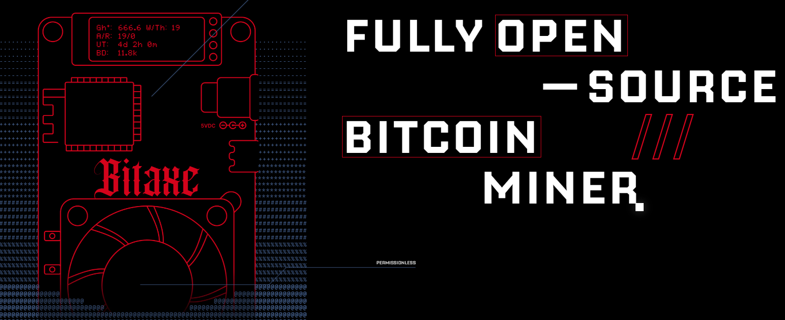

# MMM-Gamma601

A MagicMirror² module to display the current status of a BitAXE OS open source bitcoin miner

## 🧩 Functions

- Miner online/offline
- act. Hashrate
- shares / rejected
- connected mining pool
- uptime
- act. temperature and power consumpution
- simple configuration via `config.js`

## 📸 Screenshot




## 🛠️ Installation

```bash
cd ~/MagicMirror/modules
git clone https://github.com/ASteinsdoerfer/MMM-Gamma601.git
cd MMM-Gamma601
npm install
```

## 🔧 configuration
Change in config.js
```bash
{
    module: "MMM-Gamma601",
	header: "Bitcoin Miner",
    position: "middle_center",

    config: {
        ip: "192.168.178.114",
        port: 80,
        updateInterval: 300000
    }
 },
```

## Options
no options.

## 🙌 Author
ASteinsdoerfer

